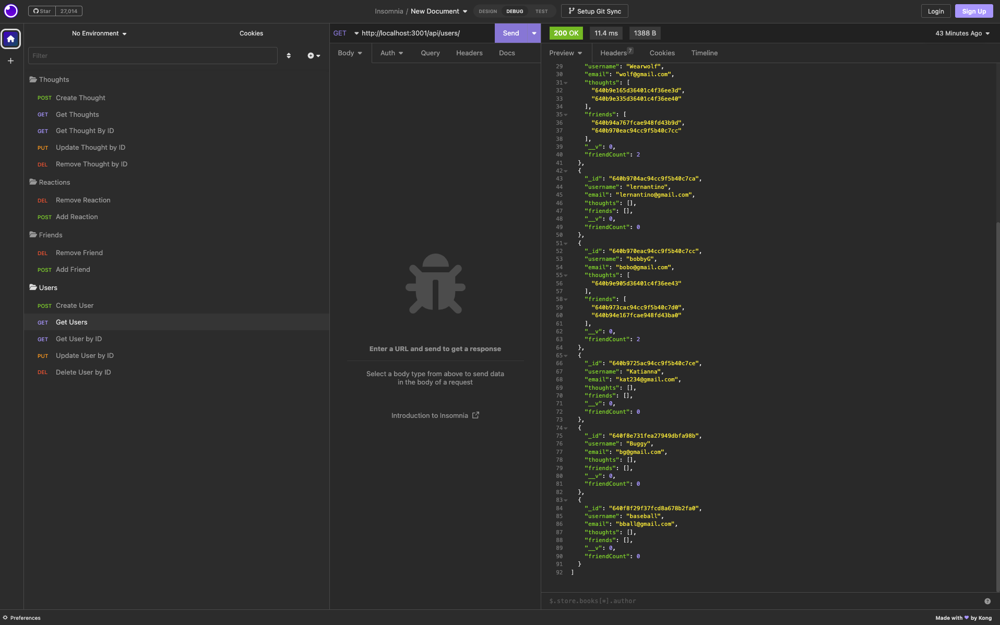

# social-network-API

## Description

This project is an example of a basic social media network's API. We use a MongoDB database with a model-controller framework to develop this application. Since social media has become a daily fact of life for so many, this backend application was developed to demonstrate how social network APIs function.

The application provides functionality to create users, add friends, create 'Thought' posts, and add reactions to posts. We use Mongoose to create a User and Thought model. Documents with client-specific attributes are generated, editted, and deleted from these models' collections by utilizing the Express server routes defined in this application.

## Table of Contents (Optional)

If your README is long, add a table of contents to make it easy for users to find what they need.

- [Installation](#installation)
- [Usage](#usage)
- [Credits](#credits)
- [License](#license)

## Installation

To install this application, clone the github repo onto your machine. Make sure you have MongoDB installed and running on your computer. See the docs for steps on how to do this (https://www.mongodb.com/docs/manual/installation/). You will also need NodeJS installed to run the application and download required with npm.

In the repo's root folder, open the CLI, and install the Mongoose and Express packages with the command:

    `npm i`

After you have installed everything, you should be ready to run the applcation.

## Usage

To start the API, enter the following command in your CLI:

    `npm run start`

This will start the express server and create a new MongoDB database. As the application stands right now, there are no seeds to prefill the database, so you will have to insert data using the Express routes.

The following routes are available for use in this application:

Users:
- [POST] "/api/users" = Adding a new User
    {
      "username": "lernantino",
      "email": "lernantino@gmail.com"
    }
- [GET] "/api/users" = Displaying all Users, showing IDs of Friends and posted Thoughts.
- [GET] "/api/users/:userId" = Fully displaying one User's data with flushed out Friends and Thoughts objects. Specified by their ID.
- [PUT] "/api/users/:userId" = Updating a User's username or email. Specified by their ID.
- [DELETE] "/api/users/:userId" = Deleting a User and their associated Thoughts. Specified by their ID.

Friends:
- [POST] "/api/users/:userId/friends/:friendId" = User adds a new friend, specified by IDs.
- [DELETE] "/api/users/:userId/friends/:friendId" = User removes a friend, specified by IDs.

Thoughts:
- [POST] "/api/thoughts" = A user creates a new thought. Specified by userId key in POST object.
    {
      "thoughtText": "Here's a cool thought...",
      "username": "lernantino",
      "userId": "5edff358a0fcb779aa7b118b"
    }
- [GET] "/api/thoughts" = Get all thoughts posted
- [GET] "/api/thoughts/thoughtId" = Display a single thought and associated reactions. Specified by thought ID.
- [PUT] "/api/thoughts/thoughtId" = Update thoughtText parameter for a single thought. Specified by thought ID.
- [DELETE] "/api/thoughts/thoughtId" = Delete a User's thought by thought ID.

Reactions:
- [POST] "/api/thoughts/:thoughtId/reactions" = A User adds a new reaction to a thought. Thought specified by thought ID.
    {
	"reactionBody": "Crazy",
	"userId": "640b970eac94cc9f5b40c7cc",
	"username": "bobbyG"
	}
- [DELETE] "/api/thoughts/:thoughtId/reactions/reactionId" = Delete reaction from Thought by reaction ID.

I would recommend using this application in Insomnia to test the routes before creating a front end.

## Credits

Mongoose: https://mongoosejs.com/

## License

MIT License

Walk through video: https://drive.google.com/file/d/19vZ4gU2PunnhR522tBwnnQbnF6JzrigC/view
